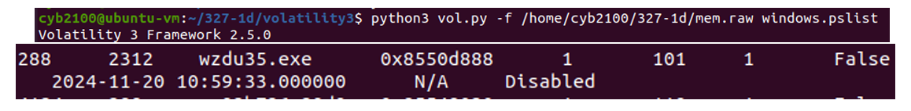
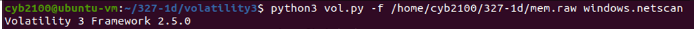
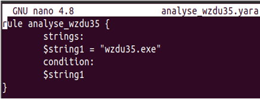
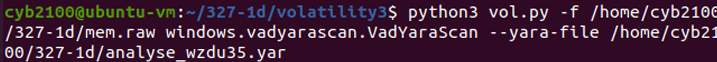
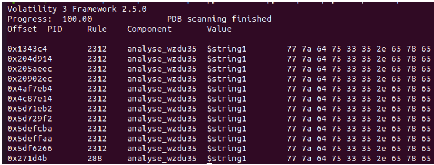

# Memory Analysis with Volatility and YARA (2024)

This lab documents how I used **Volatility 3** to analyze a memory dump, identify a suspicious process, check for network activity, and confirm indicators using a custom **YARA** rule.

---

## Table of Contents
- [Process List (pslist)](#process-list-pslist)
- [Network Scan (netscan)](#network-scan-netscan)
- [YARA Rule Creation](#yara-rule-creation)
- [YARA Scan and Results](#yara-scan-and-results)
- [Findings](#findings)

---

## Process List (pslist)

**Command used**
```bash
python3 vol.py -f mem.raw windows.pslist
```

**Result**  
The process `wzdu35.exe` was observed with **PID 2312** and **PPID 288**.



---

## Network Scan (netscan)

**Command used**
```bash
python3 vol.py -f mem.raw windows.netscan
```

**Result**  
No active network connections were found at the time of capture.



---

## YARA Rule Creation

A simple YARA rule was authored to search for a clear indicator inside memory.

**Rule content (created with `nano`)**
```yara
rule analyse_wzdu35 {
    strings:
        $s1 = "wzdu35.exe"
    condition:
        $s1
}
```



---

## YARA Scan and Results

**Command used**
```bash
python3 vol.py -f mem.raw windows.vadyarascan.VadYaraScan --yara-file analyse_wzdu35.yar
```



**Result**  
Multiple hits were observed in PID **2312** and a hit associated with the parent PID **288**, confirming the indicator was present in memory.



---

## Findings

- The suspicious process `wzdu35.exe` was present in memory with PID 2312 (parent 288).
- No network sockets were active at capture time.
- A targeted YARA rule successfully matched the expected indicator in memory.
- This workflow shows how process enumeration, network inspection and YARA scanning complement each other in memory forensics.

---

© 2024 Mahamed-Maki Saine

